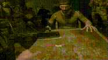

<p align="center">
  <a href="README.md"></a>
  <a href="fa.md"></a>
</p>
<p align="center">
  
</p>
<h1 align="center">ROULETTE</h1>
 
<p align="center">
  <a href="https://github.com/monji024/roulette/stargazers"></a>
  <a href="https://github.com/monji024/roulette/network/members"></a>
  <a href="https://github.com/monji024/roulette/blob/main/LICENSE"></a>
</p>
<p align="center">
  
</p>
> شیش تا خونه، یه راستش. برگشت نداره.

```
██████╗  ██████╗ ██╗   ██╗██╗     ███████╗████████╗████████╗███████╗
██╔══██╗██╔═══██╗██║   ██║██║     ██╔════╝╚══██╔══╝╚══██╔══╝██╔════╝
██████╔╝██║   ██║██║   ██║██║     █████╗     ██║      ██║   █████╗
██╔══██╗██║   ██║██║   ██║██║     ██╔══╝     ██║      ██║   ██╔══╝
██║  ██║╚██████╔╝╚██████╔╝███████╗███████╗   ██║      ██║   ███████╗
╚═╝  ╚═╝ ╚═════╝  ╚═════╝ ╚══════╝╚══════╝   ╚═╝      ╚═╝   ╚══════╝
```

**شیش گوله، شیش شانس.**
ترسو نباش، این بازی یه سر بُرده یا مرگ یا زندگی.
حس می‌کنی خیلی شجاعی؟ بیا بازی کنیم.

اگه خوشت اومد یه **استار** بزن. اگه می‌خوای روش کار کنی هم **فورک**ش کن،
دکمه‌هاش همون بالای صفحه هستن.

---

## این چیه اصلاً

ROULETTE یه بازی ترمینالیه که فقط و فقط **دو نفره** بازی می‌شه. دو نفر
یه اسلحه‌ی مشترک دارن، یه اتصال زنده‌ی TCP، و یه سوال تکراری تو هر
نوبت: دفعه‌ی بعد همونیه؟ کل موتور بازی (منطق، شبکه، رابط کاربری) با
پایتون نوشته شده، ولی یه لایه‌ی روایت جدا با روبی داره که حس و حال بازی
رو می‌سازه.

جا زدن یا بی‌خیال شدن وسط بازی معنی نداره. هر باری که زنده می‌مونی
امتیازت بالا می‌ره. اون امتیاز تنها چیزیه که می‌تونه برات یه **شانس
آخر** بخره؛ یه نجات اضطراری، فقط یه بار تو کل بازی، که باید حقشو در
بیاری، مفت بهت نمی‌دنش.

## ⚠ قوانین بازی

با اجرا کردن و وارد شدن به بازی یعنی این قوانین رو قبول کردی:

۱. **با ورود به بازی یعنی قوانین رو پذیرفتی.** این هشدار دوبار نشونت
داده نمی‌شه؛ صفحه‌ی قوانین فقط یه بار، قبل از هاست یا جوین کردن، میاد و
همون تنها اخطاریه که می‌گیری.

۲. **حق اجرای بازی روی ماشین‌های مجازی رو نداری.** این بازی برای یه
محیط واقعی و مستقیم طراحی شده، نه برای اجرا شدن تو یه VM.

۳. **هرگونه تقلب تو بازی، باختت رو تضمین می‌کنه.** دستکاری کلاینت یا
شانس‌ها هیچ فایده‌ای نداره؛ سرور مرجع اصلیه و هر تقلبی که بفهمه رو
مستقیم به باخت همون بازیکن تبدیل می‌کنه.

> اگه به خدا اعتقاد داری موقعی که خشاب رو سرته بگو نجاتت بده

## چی این بازی رو فرق می‌کنه

- **فقط چندنفره، با اتاق‌های اسم‌دار.** یه اتاق با یه اسم می‌سازی، اون
  اسمو با طرف مقابل شریک می‌شی، سرور شماها رو تو یه بازی زنده و مرجع‌دار
  جفت می‌کنه. نه بات، نه حالت تمرینی.
- **سیستم شانس آخر.** هر بازیکن دقیقاً یه بار می‌تونه یه نجات اضطراری
  برای کل بازی به دست بیاره. امتیاز قبل از هر مرگی چک می‌شه؛ اگه به
  اندازه‌ی کافی داشته باشی، به‌جای تو خرج می‌شه.
- **امتیازدهی کم و بر پایه‌ی استریک.** یه مقدار امتیاز کوچیک و ثابت به
  ازای هر بار زنده موندن، که با استریک زنده موندن پشت سر همت ضرب می‌شه.
  رسیدن به شانس آخر واقعاً ریسک لازم داره؛ نمی‌شه فارمش کرد.
- **یه صفحه‌ی قوانین قبل از هر جلسه.** قوانین به زبون ساده قبل از هاست
  یا جوین کردن نشون داده می‌شه، تا کسی کورکورانه ننشینه پای بازی.
- **یه موتور روایت جدا.** همه‌ی حس و حال بازی (متن‌های اتمسفریک، افکت
  تایپ، بنرهای اسکی‌آرت) از یه لایه‌ی جدای روبی میاد که کاملاً از منطق
  پایتون جداست.
- **آمار پایدار.** برد، باخت، بهترین امتیاز، استریک‌ها، و کل تاریخچه‌ی
  بازی‌ها (با اسم اتاق و حریف) بین سشن‌ها ذخیره می‌مونه.
- **یه گزارش مرگ برای هر باخت.** همون لحظه‌ای که یه بازی با مرگ تموم
  می‌شه، یه گزارش شخصی و قابل‌خوندن ساخته می‌شه، به‌علاوه‌ی یه لاگ فشرده
  از همه‌ی مرگ‌های تا حالا.
- **رندوم واقعاً امن.** خونه‌ی گلوله با یه منبع رندوم به‌شدت امن انتخاب
  می‌شه، نه یه جنریتور قابل‌پیش‌بینی. نتیجه رو نمی‌شه حدس زد یا مهندسی
  معکوس کرد.
- **نرم شکست می‌خوره، نه سخت.** نبود لایه‌ی روایت، قطعی اتصال، یا خراب
  شدن فایل سیو، همه با یه پیام واضح مدیریت می‌شن، نه با کرش کردن وسط
  بازی.

## نصب

### چی لازم داری

- پایتون ۳.۱۰ به بالا
- روبی (اختیاریه، ولی برای تجربه‌ی کامل روایت خیلی توصیه می‌شه؛ بدونش هم
  بازی درست کار می‌کنه، فقط ساده‌تر می‌شه)

### لینوکس / مک

```bash
git clone https://github.com/your-username/roulette.git
cd roulette
chmod +x install.sh
./install.sh

source .venv/bin/activate
python3 client/main.py
```

اگه روبی نصب نیست:

```bash
# Debian/Ubuntu
sudo apt install ruby

# macOS (Homebrew)
brew install ruby
```

### ویندوز

```bat
git clone https://github.com/your-username/roulette.git
cd roulette
install.bat

.venv\Scripts\activate
python client\main.py
```

اگه روبی نصب نیست، از [rubyinstaller.org](https://rubyinstaller.org)
بگیرش.

### چجوری یه بازی راه بندازی

۱. یه نفر بازی رو باز می‌کنه، **هاست کردن اتاق** رو می‌زنه، یه اسم اتاق
انتخاب می‌کنه و می‌تونه یه سرور محلی رو هم خودکار بالا بیاره.

۲. نفر دوم بازی رو باز می‌کنه، **جوین شدن به اتاق** رو می‌زنه و همون اسم
اتاق به‌علاوه‌ی آدرس و پورت هاست رو وارد می‌کنه.

۳. وقتی هر دو نفر تو اتاق باشن، بازی شروع می‌شه؛ از اینجا به بعد سرور
مرجع اصلیه.

برای بالا آوردن یه سرور مستقل که بشه توش چند تا اتاق همزمان داشت، یا
بازیکن‌ها از ماشین‌های مختلف وصل بشن:

```bash
python3 server/main.py
```

## ساختار پروژه

```
roulette/
├── client/
│   └── main.py        # نقطه‌ی ورود: چک‌های استارتاپ، قوانین، منو، دیسپچ
├── server/
│   └── main.py         # سرور دائمی و چندروومه که مرجع همه‌ی بازی‌هاست
├── game/
│   ├── revolver.py      # منطق خالص اسلحه (چرخوندن / شلیک / شانس‌ها)
│   ├── online.py         # شبکه‌ی سمت کلاینت + رابط کاربری بازی
│   ├── score.py            # آمار، قانون شانس آخر، ساخت گزارش مرگ
│   └── narrator.py          # پل ارتباطی به لایه‌ی روایت روبی
├── scripts/
│   ├── texts.rb            # ساخت متن‌های اتمسفریک
│   └── effects.rb           # افکت تایپ و رندر اسکی‌آرت
├── assets/
│   └── texts.txt              # مجموعه‌ی دسته‌بندی‌شده‌ی متن‌های روایت
├── data/
│   ├── scores.json             # آمار پایدار بازیکن‌ها
│   └── deaths.log               # لاگ append-only از مرگ‌ها
├── install.sh / install.bat       # نصب‌کننده‌های هر پلتفرم
└── requirements.txt
```

**اصول طراحی:**

- **اتاق، نه جفت‌کردن خام.** تنها چیزی که دو بازیکن از قبل باید روش
  توافق کنن، یه اسم اتاقه؛ نیازی به هماهنگی ترتیب وصل شدن نیست.
- **سرور مرجعه.** همه‌ی رندوم‌سازی و اجرای قوانین -از جمله چک شانس آخر-
  سمت سرور و قبل از فینال شدن هر مرگی انجام می‌شه. کلاینت‌ها فقط وضعیت
  رو نشون می‌دن و نیت‌شون (`pull`) رو می‌فرستن؛ رأی ندارن.
- **جدا بودن صدا از منطق.** پایتون هیچ‌وقت متن اتمسفریک رو داخل کد
  هاردکد نمی‌کنه. هر خط، هر افکت تایپ، هر بنر اسکی‌آرت از لایه‌ی روبی و
  از طریق `game/narrator.py` خواسته می‌شه، که خودش `scripts/texts.rb` و
  `scripts/effects.rb` رو صدا می‌زنه.
- **هسته‌ی کوچیک و قابل تست.** `game/revolver.py` هیچ وابستگی به رابط
  کاربری یا I/O نداره، برای همین می‌شه مکانیک اصلی رو کاملاً جدا از بقیه
  تست کرد.
- **شکست نرم، نه سخت.** نبود روبی، قطع شدن اتصال، خراب شدن فایل سیو، یا
  مشکل دسترسی، همه با یه پیام واضح مدیریت می‌شن، نه با کرش کردن و ولش
  کردن.


## لایسنس

MIT — فایل `LICENSE` رو ببین.
